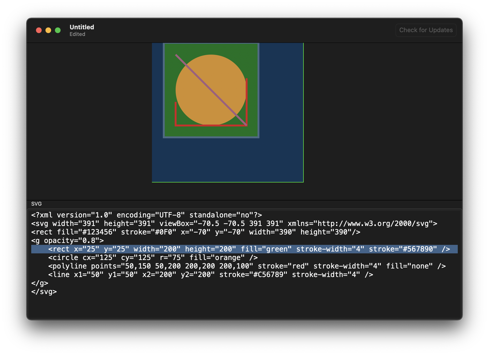

# MicroVector

Native macOS SVG viewer

This is a template project for demonstrating continuous deployment with a notarized mac OS app writte purely in SwiftUI and embedding the Sparkle framework.

The app runs on macOS 11.1 (universal ARM & Intel). Download the latest released [`MicroVector.zip`](https://github.com/hubomatic/MicroVector/releases/latest/download/MicroVector.zip) and install by dragging the expanded `MicroVector.app` into your `Applications` folder. 

The app can open `.svg` files and show a live preview of the contents.

